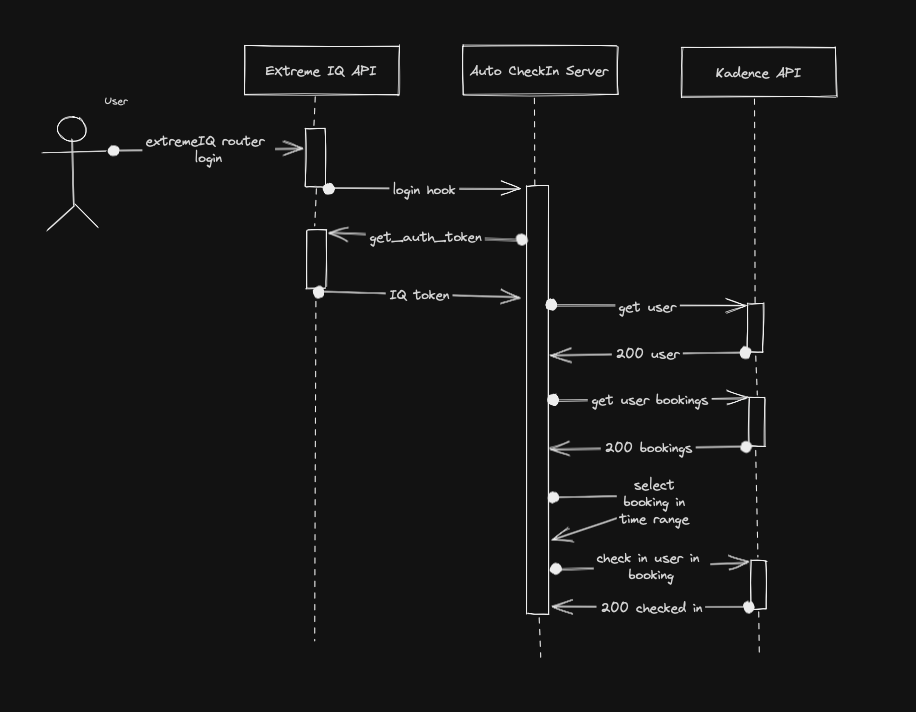

# ExtremeCloudIQ Integration with Kadence API

## Description

Extreme-Kadence is an aplication made with Python's FastAPI framework and Hexagonal Architecture.

The goal is to automatically check-in and check-out users in kadence bookings from login events in ExtremeCloudIQ routers.

## Overview

This project is comprised of the following languages and libraries:

* Language: [Python 3.11](https://www.python.org/)
* Web framework: [FastAPI](https://fastapi.tiangolo.com/)
* Production web server: [Uvicorn](http://www.uvicorn.org/)
* Data parsing and validation: [Pydantic](https://pydantic-docs.helpmanual.io/)
* Testing: [Pytest](https://docs.pytest.org/en/latest/)
* Linter: [Flake8](https://flake8.pycqa.org/en/latest/)
* Static type checker: [Mypy](https://mypy.readthedocs.io/en/stable/index.html)
* Formatter: [Black](https://github.com/psf/black)

## Development

To start development it is recommended to have these utilities installed in a local development machine:

* [Python 3.11](https://www.python.org/)
* [Docker](https://www.docker.com/)

For better development experience, it is recommended these tools:

* [Visual Studio Code](https://code.visualstudio.com/)

### Running the API

To run the API in development mode, follow these steps:

* Start a container with: `docker compose up -d`
* Test the API with: `pytest`
* Check code style with: `black --check app`
* Format code with: `black app`
* Lint the code with: `flake8 app tests`
* Run static analysis with: `mypy job_form_api tests`

### Linting, static check and code style guide

Flake8 is the tool of choice for linting. It is configured to warn about code problems, complexity problems, common bugs and to help developers write better code.

Mypy is the tool of choice for static type checking. This project adopts gradual typing as the metodology for code typing. The rules of Mypy will be updated periodically to ensure that the entire code base is typed and consistent.

Black is the tool of choice for formating and code style guide. Black is an uncompromising formatter for Python code, that is, no code style discussions are necessary, the tool is always correct.

Linter and static type checking rules can be discussed and reviewed with the entire team. Any merge request that tries to change these rules without consent is automatically rejected and closed.

## Architecture

### TODO:

- [ ] Add non-root user in docker (use FastAPI user)
- [x] Fix hot reload in development docker
- [ ] Remove uvicorn --reload flag for production
- [ ] Add python logger
- [ ] Add linter
- [ ] Add mypy
- [ ] Add unit and integration test
- [ ] Add formatter 
- [ ] Add health check

Kadence:
 - [ ] Build logic to find the booking based on datetime
 - [x] Create util function to handle link pagination
 - [ ] Build Check IN Controller

 ExtremeCloudIQ:
 - [ ] Create endpoint to regiter a webhook
 - [ ] Create an endpoint for kadence auth
 